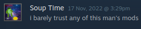

Holy shit the Starbound modding community is toxic as fuck. I don't give a fuck about the drama a few individuals in the community continue to publicly bring up on their [mod pages](https://steamcommunity.com/sharedfiles/filedetails/?id=2897583378). This has seemingly been going on for *years*.

Some of the same individuals upload shitpost and troll mods. They claim these mods '[work](https://steamcommunity.com/workshop/filedetails/discussion/2627391928/5221353200110036593/)', and seem to delete comments which claim otherwise.
This has poisoned the well for me, so I have made this page in order to server as a reminder for myself to heavily scrutinize Mods from these creators:

- [patman](https://steamcommunity.com/id/patmanf) (confirmed f-word r-word -- [Rail Platform Lag Fix](https://steamcommunity.com/sharedfiles/filedetails/?id=2627391928) is the reason this page exists)
- [Silver Sokolova](https://steamcommunity.com/id/SilverSokolova) (maybe safe -- participated in mod support trolling)

